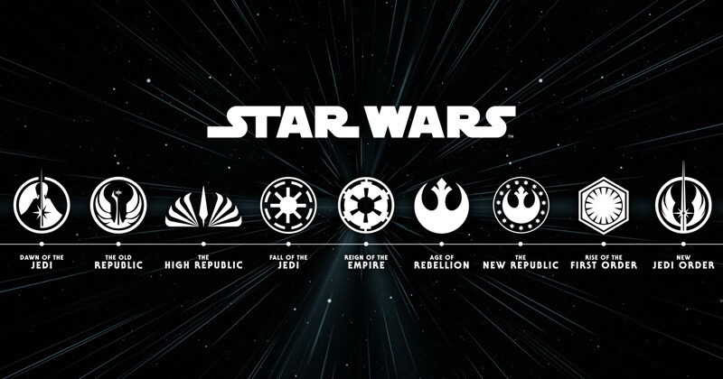

# Star Wars Timeline Knowledge Graph



A knowledge graph project that organizes and visualizes Star Wars universe events, characters, and entities using semantic web technologies and LLM-powered summarization.

## Features

- SPARQL query interface for exploring Star Wars universe data
- LLM-powered event summarization
- Interactive graph visualization
- Entity embeddings for semantic search
- Timeline-based event organization

## Requirements

- Python 3.8+
- Ollama (for LLM functionality)
- Required Python packages:
  ```
  ollama
  rdflib
  networkx
  matplotlib
  pickle
  ```

## Installation

1. Clone the repository:
   ```bash
   git clone https://github.com/Jovillios/starwars-timeline-kg
   cd starwars-timeline-kg
   ```

2. Install Python dependencies:
   ```bash
   pip install -r requirements.txt
   ```

3. Install and configure Ollama:

   ### macOS
   ```bash
   # Install Ollama
   brew install ollama
   
   # Start Ollama service
   ollama serve
   ```

   ### Windows
   ```bash
   # Download and install Ollama from https://ollama.ai/download
   # Run the installer and follow the setup instructions
   
   # Start Ollama service (it should start automatically after installation)
   # If needed, you can start it manually from the Start menu
   ```

   ### Linux
   ```bash
   # Install using curl
   curl -fsSL https://ollama.ai/install.sh | sh
   
   # Start Ollama service
   ollama serve
   
   # For Ubuntu/Debian, you can also use:
   sudo apt install ollama
   ```

   After installation, verify Ollama is running by checking:
   ```bash
   ollama list
   ```

## Model Recommendations

The project uses Ollama for LLM functionality. Here are recommended models based on your system configuration:

### Low RAM/VRAM Systems (< 4GB RAM)
- `gemma3:1b`
- `llama3.2:1b`

### Medium RAM/VRAM Systems (4-8GB RAM)
- `gemma3:4b` - Default model used in the project, good balance of performance and resource usage
- `llama3.2:3b` 

### High RAM/VRAM Systems (> 8GB RAM)
- `gemma3:12b` - Enhanced version with better performance
- `llama3.1:8b`

To use a specific model, modify the `model_name` parameter in `llm.py` or pass it as an argument when running the application:
```python
# In llm.py
llm = LLM(model_name="gemma3:4b")  # or your preferred model

# When running the application
python main.py --llm_model_name "gemma3:4b"
```

The default embedding model is `nomic-embed-text`. You can change it using:
```python
# When running the application
python main.py --embed_model_name "your_embedding_model"
```

## Usage

### Running the pruning/benchmark

```bash
python main.py [arguments]
```

#### Argument 

- `--pruning_method`: The pruning method to use. Choices are PruneTTL, PruneBACKPERF, PruneSummarize. Required unless --pre_pruned is set.
- `--embed_model_name`: Name of the embedding model. Required unless --pre_pruned is set.
- `--llm_model_name`: Name of the LLM model.
- `--benchmark_file`: Path to the benchmark file.
- `--threshold`: Threshold for PruneBACKPERF pruning. Default is 0.1
- `--topk`: Top k value for benchmark (used for the RAG). Default is 10.
- `--prune_topk`: Top k value for PruneBACKPERF pruning. Default is 100.
- `--min_year`: Minimum year for PruneTTL pruning.
- `--pre_pruned`: Flag indicating that the graph is already pruned. If set, the script will load the pre-pruned graph and skip the pruning process.
- `--save`: Save the pruned graph to the specified file.


### Running the Application
```bash
python app.py
```

#### Example SPARQL Queries

Get all things in the Star Wars universe with their names:
```sparql
prefix rdf: <http://www.w3.org/1999/02/22-rdf-syntax-ns#>
prefix rdfs: <http://www.w3.org/2000/01/rdf-schema#>
prefix sw: <https://starwars.fandom.com>
prefix xsd: <http://www.w3.org/2001/XMLSchema#>

SELECT ?thing ?name WHERE {
    ?thing rdf:type sw:Thing ;
           sw:name ?name .
}
```

Get all events in the Star Wars universe with their descriptions and dates:
```sparql
prefix rdf: <http://www.w3.org/1999/02/22-rdf-syntax-ns#>
prefix rdfs: <http://www.w3.org/2000/01/rdf-schema#>
prefix sw: <https://starwars.fandom.com>
prefix xsd: <http://www.w3.org/2001/XMLSchema#>

SELECT ?event ?description ?eventYear WHERE {
    ?event rdf:type sw:Event ;
    sw:description ?description ;
    sw:eventYear ?eventYear .
    FILTER (xsd:integer(?eventYear) >= 0)
}
```

## Project Structure

- `main.py` - Main application entry point
- `llm.py` - LLM integration and embedding functionality
- `create_graph.py` - Knowledge graph creation and management
- `prune.py` - Graph pruning and optimization
- `show_graph.py` - Visualization utilities
- `utils.py` - Helper functions
- `ttl/` - Turtle files containing RDF data
- `docs/` - Documentation and additional resources